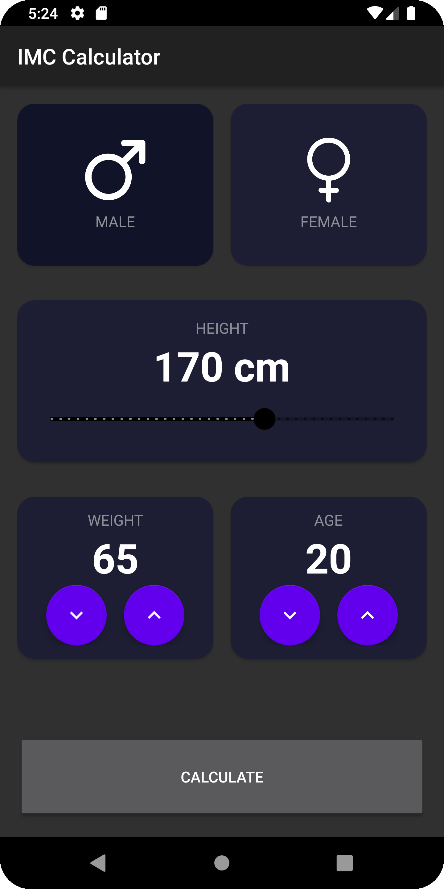
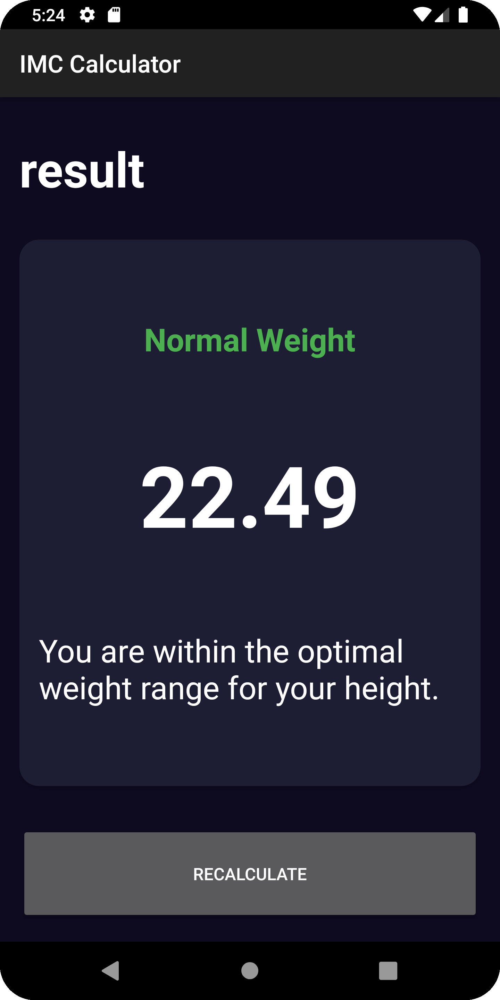

# IMC Calculator App
## Overview

The IMC Calculator App is an Android application that helps users calculate their Body Mass Index (BMI) by inputting their gender, weight, height, and age. The app then provides a result indicating whether the user is underweight, normal weight, overweight, or obese, along with a detailed description.

<p align="center">
    
    
</p>

## Features

- **Gender Selection:** Choose between male and female for more accurate BMI calculation.
- **Height Input:** Adjustable height input using a range slider.
- **Weight and Age Control:** Increment and decrement buttons for easy weight and age input.
- **BMI Calculation:** Calculates BMI and displays the result with a categorized description.
- **Recalculation:** Option to recalculate BMI.

## Installation

To run this app locally, follow these steps:

1. **Clone the repository:**
    ```sh
    git clone https://github.com/ManuelCobos24/IMCCalculator.git
    ```

2. **Open the project in Android Studio:**
    - Navigate to `File > Open` and select the cloned repository's folder.

3. **Build the project:**
    - Click on the "Build" menu and select "Make Project" or use the shortcut `Ctrl+F9`.

4. **Run the app:**
    - Click on the "Run" button or use the shortcut `Shift+F10`.

## Usage

1. **Open the App:**
    - Launch the IMC Calculator App on your Android device.

2. **Input Data:**
    - Select your gender by tapping the male or female card.
    - Adjust your height using the slider.
    - Use the plus and minus buttons to set your weight and age.

3. **Calculate BMI:**
    - Tap the "Calculate" button to see your BMI result.

4. **View Result:**
    - The app will display your BMI, categorize it, and provide a detailed description.
    - Tap the "Recalculate" button if you want to perform another calculation.

## Code Structure

The app consists of two main activities:

1. **IMC_CalculatorActivity:** This activity handles the user input for gender, weight, height, and age, and calculates the BMI.
2. **ResultIMCActivity:** This activity displays the calculated BMI result and its corresponding category.

## Contributing

Contributions are welcome! Please follow these steps:

1. **Fork the repository.**
2. **Create a new branch:** `git checkout -b feature/your-feature-name`
3. **Commit your changes:** `git commit -m 'Add some feature'`
4. **Push to the branch:** `git push origin feature/your-feature-name`
5. **Create a pull request.**